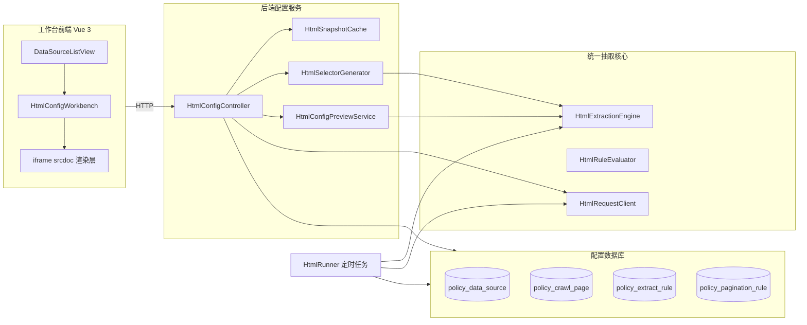
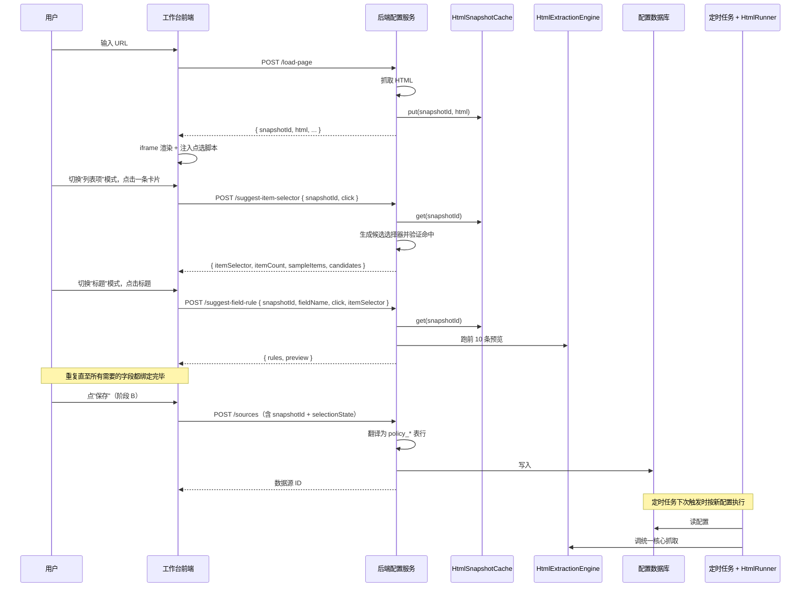
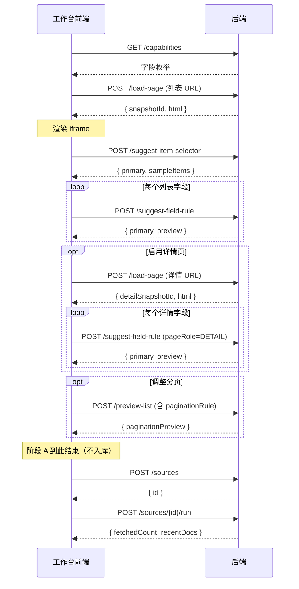

# 点选式 HTML 爬虫配置工作台 PRD（V2）

## 0. 文档说明

### 0.1 文档定位

本文档是产品需求规格（Product Requirements Specification），不是设计说明，也不是产品愿景介绍。本文档的唯一目标是：**前端开发者和后端开发者拿到本文档之后，可以独立完成各自的开发任务，过程中不需要再去找产品经理澄清功能边界。**

### 0.2 阅读约定

- 本文档中出现的"必须"、"不得"、"应当"、"可以"按 RFC 2119 解读：
  - "必须 / 不得" 表示强制要求，违反即视为不符合需求。
  - "应当" 表示推荐做法，除非有充分理由不得偏离。
  - "可以" 表示可选实现。
- 所有"前端"指 Vue 3 + TypeScript 工程，目录 `frontend/`。
- 所有"后端"指 Spring Boot 工程，目录 `src/main/java/com/policyradar/`。
- 文中提到的数据库字段以 `policy_*` 表的现有字段为准（详见第 7 章）。
- 文中所有 JSON 示例字段名均为最终接口字段名，开发时不得改名。
- 文中所有截止当前版本未实现的接口、类、方法、文件路径，均按本文档约定的命名为准，开发时按此命名落地。

### 0.3 适用版本

- 本文档对应可视化配置工作台第一个可用版本，版本号 `1.0.0`。
- 本文档替代 `docs/HTML爬虫配置工作台PRD.md`（V1）。V1 中与本文档冲突之处以本文档为准。
- 本文档不覆盖 `docs/HTML爬虫抽取核心重构设计.md`（后端核心重构设计），二者关系见第 3.3 节。

### 0.4 阶段切分

本版本（1.0.0）分两个阶段交付：

- **阶段 A：点选预览闭环**。用户可以在工作台输入 URL、点选元素、查看实时提取结果，但不能保存配置。本文档第 5 章、第 8 章前 6 个接口、第 17.1 节验收标准对应阶段 A。
- **阶段 B：保存与试跑**。用户可以保存配置进数据库，并立即触发一次抓取看入库结果。对应第 8.7、8.8 节接口、第 17.2 节验收标准。

阶段 A 必须先于阶段 B 完成，且阶段 A 必须独立可演示（即"看着提取结果好不好"本身就是一个可交付的产品状态）。

---

## 1. 产品背景与目标

### 1.1 背景

系统现有静态 HTML 爬虫执行器 `HtmlRunner`，依赖以下数据库表完成配置驱动的爬取：

- `policy_data_source`：数据源元信息。
- `policy_crawl_page`：列表页 / 详情页配置（含 `itemSelector`）。
- `policy_extract_rule`：字段提取规则（CSS 选择器 + valueType + 后处理）。
- `policy_pagination_rule`：分页规则。

现状问题：

- 上述配置依赖 SQL 与 CSS 选择器，业务用户无法独立完成。
- 用户写完配置只能等任务跑完看结果，无法即时验证。
- 复杂网站（多层嵌套、不规则结构）需要反复试错，工程负担大。

### 1.2 产品目标

构建一个面向静态 HTML 网站的可视化爬虫配置工作台。用户在工作台输入列表页 URL，通过点选页面元素表达"我要爬什么"，工作台实时反馈"按当前规则能爬到什么"，最终把规则保存为现有 `policy_*` 配置。`HtmlRunner` 不需要任何改造即可消费这套配置。

### 1.3 不在本版本范围内的目标

以下能力本版本不实现，不论功能多么自然或多么"应该有"：

- JavaScript 动态渲染页面（包括 SPA、AJAX 列表）。
- 登录态、Cookie、验证码、强反爬场景。
- Playwright / Selenium / 浏览器引擎渲染。
- 一个数据源中配置多组互不相关的列表（即"多组 items"）。
- 不属于任何列表项的页面级孤立字段（即"PAGE 级 scope"）。
- 配置导入导出、站点模板库、SQL 一键生成。
- 用户在工作台内手写 CSS 选择器进行配置（高级模式只允许查看和微调，不允许从零手写整套规则）。

如果用户场景需要"一个网页上多组列表"，本版本通过"在同一个 URL 上创建多个独立的 `PolicyDataSource`"来满足，每个数据源覆盖网页的一个区域。详见第 5.4 节。

---

## 2. 名词定义

为避免歧义，本文档涉及到的所有名词在此一次性定义。后续章节出现以下名词均按此处约定使用，不得另作解释。

| 名词 | 定义 |
| --- | --- |
| 工作台 | 本产品的前端 SPA 页面集合，挂载于 `/html-config` 路由下。 |
| 数据源（DataSource） | `policy_data_source` 表中的一条记录。一个数据源对应一套完整的爬取规则。 |
| 列表页（List Page） | `policy_crawl_page` 中 `pageRole = LIST` 的记录。一个数据源**有且仅有一条**列表页。 |
| 详情页（Detail Page） | `policy_crawl_page` 中 `pageRole = DETAIL` 的记录。一个数据源**至多有一条**详情页（可选）。 |
| 列表项（Item） | 列表页 HTML 中通过 `itemSelector` 切出的一个 DOM 节点。每条列表项对应一条 `RawDoc`。 |
| 字段（Field） | `RawDoc` 中的一个语义字段，例如 `title`、`url`、`publishDate`。完整字段集见第 7.5 节。 |
| 字段规则（FieldRule） | `policy_extract_rule` 表中的一条记录，描述某个字段如何从 DOM 取值。 |
| 兜底规则（Fallback Rule） | 同一字段下的多条规则按 `sortOrder` 顺序尝试，前一条返回 `null` 时使用后一条。 |
| 快照（Snapshot） | 后端通过 `load-page` 接口抓回的原始 HTML 字符串。后端缓存快照供后续接口使用，前端不持久化。 |
| 快照 ID（snapshotId） | 后端给一份快照分配的 UUID，用于后续接口引用同一份 HTML。 |
| 选择状态（SelectionState） | 前端工作台内存中的当前配置进度对象。详见第 10.3 节。 |
| 点选信息（ClickedElementInfo） | 用户在 iframe 内点击一个 DOM 元素时，前端采集到的该元素信息。详见第 11.1 节。 |
| 候选选择器（SelectorCandidate） | 后端针对一次点选生成的多个 CSS 选择器候选，按置信度排序。 |
| 默认模式 | 工作台界面的默认呈现模式，**不展示任何 CSS 选择器或数据库字段**。 |
| 高级模式 | 工作台界面的高级呈现模式，展示 CSS 选择器、`valueType`、字段规则原始结构等技术细节，可微调。 |
| 阶段 A / 阶段 B | 见 0.4 节。 |

---

## 3. 系统总览

### 3.1 系统组件图



### 3.2 端到端数据流



### 3.3 与现有后端的关系

- 工作台后端**复用**统一抽取核心（`HtmlExtractionEngine`、`HtmlRuleEvaluator`、`HtmlRequestClient`）。预览 / 选择器生成 / 命中验证全部通过这些核心组件完成，**不得在工作台后端内实现独立的 CSS 解析或字段提取逻辑**。
- 工作台后端**不修改** `HtmlRunner`，只生产 `HtmlRunner` 能直接消费的数据库行。
- 工作台后端**不修改** `policy_*` 表结构，只新增数据。

### 3.4 技术栈与版本约束

| 组件 | 技术 | 备注 |
| --- | --- | --- |
| 前端框架 | Vue 3 + TypeScript + Vite | 已存在的 `frontend/` 工程 |
| 前端 HTTP 客户端 | axios | 沿用项目现有封装 |
| 前端 UI 库 | Element Plus 或 Ant Design Vue | 由开发者选定，但全工作台必须只用一个 |
| 后端框架 | Spring Boot 2.x（项目现有版本） | 不升级 |
| HTML 解析 | Jsoup | 沿用 `JsoupRequestClient` |
| 缓存 | Caffeine | 通过 Spring Cache 抽象使用 |
| 数据库 | 项目现有数据库 | 不增表、不改字段 |

---

## 4. 用户与权限

### 4.1 用户类型

| 用户类型 | 描述 | 主要诉求 |
| --- | --- | --- |
| 业务用户 | 政策研究员、运营人员，不写代码、不懂 CSS / SQL | 输入 URL，点几下完成配置，看到爬出来的数据正确 |
| 高级用户 | 开发或运维，懂 CSS / Jsoup / 数据库 | 在业务用户配置基础上做微调；或为复杂网站直接写选择器；查看预览原始响应排查问题 |

### 4.2 默认模式与高级模式

工作台所有界面**必须**支持默认模式与高级模式切换，开关位置在工作台右上角。

**默认模式必须满足**：

- 不展示任何 CSS 选择器字符串。
- 不展示 `valueType`、`scope`、`attrName`、`regexPattern`、`dateFormat` 等技术参数。
- 不展示数据库表名、字段名。
- 错误提示使用自然语言（例：将"`itemSelector` 命中数为 0" 显示为"还没识别出列表，请尝试点更外层的卡片"）。
- 字段名以人类可读名展示（例：`publishDate` 显示为"发布日期"）。

**高级模式必须满足**：

- 展示当前 `itemSelector`，可手动编辑。
- 每条字段规则展示完整的 `selector / valueType / attrName / regexPattern / dateFormat / required / sortOrder`，可手动编辑。
- 展示后端预览接口的原始 JSON 响应（可折叠面板）。
- 展示当前 `selectionState` 完整结构（只读 JSON 视图）。
- 默认模式下隐藏的所有错误信息均以原文展示。

模式切换**不得**触发任何后端调用，**不得**改变 `selectionState` 内容，仅影响 UI 呈现。

### 4.3 权限范围

本版本不引入新的权限模型。可访问 `/html-config` 路由的用户即可使用全部功能。后续接入登录鉴权时的接入点为前端路由守卫和后端 Spring Security 配置，本文档不展开。

---

## 5. 功能范围

### 5.1 功能清单（对应阶段）

| 编号 | 功能 | 阶段 | 必须 / 可选 |
| --- | --- | --- | --- |
| F1 | 数据源列表：浏览、新建、复制、编辑跳转、删除 | B | 必须 |
| F2 | 同 URL 多数据源：用户在已有数据源基础上"复制 URL 新建"，独立配置 | B | 必须 |
| F3 | 输入 URL 加载页面（含 headers、超时配置） | A | 必须 |
| F4 | iframe 渲染快照 + 点选脚本注入 | A | 必须 |
| F5 | 列表项点选：识别 `itemSelector` + 高亮所有同类 + 命中数反馈 | A | 必须 |
| F6 | 列表字段点选：title / url / publishDate / source / summary | A | 必须 |
| F7 | 列表字段实时预览：前 10 条提取结果 + 字段命中率 | A | 必须 |
| F8 | 详情页二级流程：加载详情快照 + 字段点选 + 预览 | A | 必须 |
| F9 | 分页配置：NONE / URL_TEMPLATE | A | 必须 |
| F10 | 高级模式：查看 / 编辑选择器和规则参数 | A | 必须 |
| F11 | 撤销 / 重选 / 删除字段 | A | 必须 |
| F12 | 兜底规则：同字段配置多条规则按顺序尝试 | B | 必须 |
| F13 | 保存配置：写入 `policy_*` 表 | B | 必须 |
| F14 | 立即试跑：触发一次抓取并展示入库结果 | B | 必须 |
| F15 | NEXT_SELECTOR 分页 | — | 不做 |
| F16 | 多组 items / PAGE 级字段 | — | 不做 |
| F17 | 站点模板库 / 配置导入导出 | — | 不做 |

### 5.2 必须支持的字段

工作台必须支持配置以下字段，字段名以 `RawDoc` 字段名为准。

**列表页可绑定字段**：

| 字段名 | 中文标签 | scope | 默认 valueType | 必填 |
| --- | --- | --- | --- | --- |
| `title` | 标题 | ITEM | TEXT | 是（保存时） |
| `url` | 原文链接 | ITEM | ATTR(href) | 是（保存时） |
| `publishDate` | 发布日期 | ITEM | TEXT | 否 |
| `source` | 来源 | ITEM | TEXT | 否 |
| `summary` | 摘要 | ITEM | TEXT | 否 |

**详情页可绑定字段**：

| 字段名 | 中文标签 | scope | 默认 valueType | 必填 |
| --- | --- | --- | --- | --- |
| `title` | 完整标题 | DETAIL | TEXT | 否 |
| `content` | 正文 | DETAIL | HTML | 否 |
| `publishDate` | 发布日期 | DETAIL | TEXT | 否 |
| `issuingAgency` | 发布机构 | DETAIL | TEXT | 否 |
| `documentNumber` | 文号 | DETAIL | TEXT | 否 |

字段语义和 `RawDoc` 一致。任何不在上表中的字段名前端不得使用，后端不得接受。

### 5.3 必须支持的 valueType

工作台必须支持以下五种 `valueType`，前端在高级模式中允许用户切换。

| valueType | 含义 | 必需附带字段 |
| --- | --- | --- |
| TEXT | 取元素的纯文本（`Element.text()`），自动 trim | 无 |
| ATTR | 取元素属性 | `attrName`（必填） |
| HTML | 取元素的 outerHTML | 无 |
| CONST | 直接取常量字符串，与点选元素无关 | `constValue`（必填） |
| REGEX | 在元素纯文本上跑正则取第 1 分组 | `regexPattern`（必填） |

`regexPattern` 字段在 `valueType != REGEX` 时也允许配置，作为后处理步骤：先按 `valueType` 取值，再用 `regexPattern` 抽取一次；若正则未命中则视为该规则失败（详见现有 `FieldExtractor` 已实现的语义，本文档不重复）。

### 5.4 同 URL 多数据源

为支持"一个网页上有多个互不相关的列表区域"这种场景，本版本约定：

- 一个 `PolicyDataSource` **有且仅有一条** `pageRole = LIST` 的 `PolicyCrawlPage`。
- 同一个 URL 上若存在多个区域，用户**必须**为每个区域创建一个独立的数据源。
- 数据源列表页（`DataSourceListView`）必须提供"基于现有数据源复制 URL 新建"的入口，使得多个数据源共享 URL 时操作流畅。
- 同 URL 多数据源在 `HtmlRunner` 调度时各自独立，互不干扰；最终入库通过 `RawDoc.url` 去重。

**用户表达"多区域"的方式不是在工作台单次配置中切换多组，而是创建多个数据源，每个走完整的单组配置流程。** 工作台 UI 不得出现"添加第二组列表"按钮。

### 5.5 非目标（再次明确）

第 1.3 节列出的非目标在本版本**任何阶段**都不得通过任何手段引入，包括但不限于隐藏入口、URL 参数、配置文件开关。

---

## 6. 端到端用户旅程

本章描述阶段 A + 阶段 B 全部交付后的完整用户体验。前后端开发实现时必须能让用户走通本章描述的每一个步骤，每一步的反馈必须与本章描述一致。

### 6.1 旅程 1：从零创建一个数据源

**步骤 1**：用户访问 `/html-config`，进入数据源列表页。

- 列表展示所有 `PolicyDataSource` 中 `type = HTML` 的记录。
- 每行展示：名称、URL、启用状态、最后修改时间、操作按钮（编辑、复制、删除、立即试跑）。
- 顶部有"新建数据源"按钮。

**步骤 2**：用户点"新建数据源"。

- 弹出表单：数据源名称（必填）、列表页 URL（必填）、Cron 表达式（选填，默认空）、超时（选填，默认 15000ms）、headers JSON（选填，默认空）。
- 用户填写后点"开始配置"，进入工作台主页面。

**步骤 3**：工作台主页面初始化。

- 中间区域显示"正在加载页面..."loading。
- 后端 `load-page` 接口返回成功后，中间区域用 iframe 渲染页面。
- 顶部状态栏显示：当前 URL、HTTP 状态码、加载耗时。
- 左侧步骤面板高亮"步骤 2：识别列表项"。

**步骤 4**：用户切到"识别列表项"模式（左侧步骤自动激活该模式），鼠标悬停在列表第一条卡片上。

- 鼠标悬停元素显示浅色边框（高亮规则见第 11.2 节）。
- 用户点击该卡片。
- 前端调 `suggest-item-selector` 接口。
- 后端返回候选选择器和命中数。
- 工作台在 iframe 中高亮所有命中的同类元素（统一背景色）。
- 右侧"配置进度"面板更新：列表项已识别，命中 N 条。
- 默认模式下显示"已识别 20 条政策卡片，对吗？"自然语言反馈。

**步骤 5**：用户切到"标题"模式，点击第一条卡片中的标题文字。

- 前端调 `suggest-field-rule` 接口，传入 `fieldName=title`。
- 后端返回字段规则候选 + 前 10 条预览结果。
- 右侧"实时预览"面板更新：title 列填入前 10 条结果。
- 默认模式下显示"已绑定标题，10 条都成功取到"反馈。

**步骤 6**：用户重复步骤 5 完成 url、publishDate（其它字段可选）。

- 每绑一个字段，预览面板新增一列。
- url 字段必须显示"是否已补全为绝对地址"反馈。
- publishDate 字段必须显示"日期解析成功率"。

**步骤 7**：用户配置分页（左侧步骤"分页"）。

- 选择 NONE 或 URL_TEMPLATE。
- 选 URL_TEMPLATE 时填写模板（含 `{page}` 占位）、起始页、最大页。
- 点"预览分页"按钮触发后端跑前 1-3 页的命中验证（由 `preview-list` 接口附带 `paginationRule` 参数实现）。

**步骤 8**：用户决定是否启用详情页（左侧步骤"详情页字段"）。

- 默认关闭。
- 用户开启后，工作台用第一条预览中的 url 加载详情页快照（再调一次 `load-page`，得到新的 `snapshotId`）。
- 中间区域 iframe 切换为详情页快照。
- 用户切到 content / publishDate / issuingAgency / documentNumber 等模式点选。
- 每次点选触发 `suggest-field-rule` + `preview-detail`。

**步骤 9**：用户点"保存配置"。

- 前端做客户端校验（详见 7.7 节）。
- 校验通过后调 `POST /sources` 接口，传入 `selectionState` + `snapshotId`。
- 后端做服务端校验，写入 `policy_*` 表，返回数据源 ID。
- 工作台跳转回数据源列表页，新数据源已出现。

**步骤 10**（可选）：用户在列表页点"立即试跑"。

- 后端调 `HtmlRunner.fetch()`，结果异步流回前端。
- 工作台展示：抓取数量、入库数量、最近 10 条入库文档。

### 6.2 旅程 2：在已有数据源基础上为同 URL 加新区域

**步骤 1**：用户在数据源列表页，找到目标 URL 的现有数据源。

**步骤 2**：用户点该行的"复制 URL 新建"按钮。

- 弹出新建表单，URL 字段已预填，名称字段需要重新填写。
- 用户填名称后进入工作台。

**步骤 3**：之后流程同 6.1 步骤 3-9，但在步骤 4 点选列表项时，用户应当点击新区域的卡片，让 `itemSelector` 锁定到该区域（详见第 12.4 节区域限定规则）。

### 6.3 旅程 3：编辑已有数据源

**步骤 1**：用户在数据源列表页点"编辑"。

**步骤 2**：工作台进入编辑模式：

- 后端 `GET /sources/{id}` 返回完整配置（数据源 + 列表页 + 详情页 + 规则 + 分页）。
- 前端把这套配置反向填入 `selectionState`（包括 `itemSelector`、各字段规则、分页配置）。
- iframe 用当前 URL 重新加载快照（不是用旧 HTML）。
- 用户可以重新点选覆盖已有规则，也可以保留原规则。

**步骤 3**：用户点"保存"，前端调 `PUT /sources/{id}`，后端做覆盖式更新（先删旧规则、旧 page、旧分页，再插新的）。

### 6.4 旅程 4：错误恢复

任何一步失败时（页面加载失败、命中数为 0、字段提取为空等）的反馈见第 15 章。用户**必须**能通过界面提示自行判断下一步动作（重选元素、换更外层、改 valueType 等），不得出现没有提示的失败状态。

---

## 7. 数据模型

本章约定工作台与现有数据库的字段对应关系。所有字段名、类型、约束以本章为准。

### 7.1 PolicyDataSource

对应表 `policy_data_source`，已存在。

| 字段 | 类型 | 工作台用法 | 必填 |
| --- | --- | --- | --- |
| id | bigint | 主键，由数据库生成 | 系统 |
| name | varchar | 数据源名称，用户在新建表单中填写 | 是 |
| type | varchar | 工作台创建的数据源**必须**写入字符串 `HTML` | 是 |
| config | text(JSON) | 工作台不使用此字段，新建时写入 `null` | 否 |
| scriptPath | varchar | 工作台不使用，写 `null` | 否 |
| enabled | boolean | 默认 `true`；用户在数据源列表页可切换 | 是 |
| cronExpr | varchar | 用户在新建表单中填写，可为空（表示不参与定时调度） | 否 |
| lastPublishedAt | datetime | 工作台不修改，仅展示 | 系统 |

### 7.2 PolicyCrawlPage

对应表 `policy_crawl_page`，已存在。

| 字段 | 类型 | 工作台用法 | 必填 |
| --- | --- | --- | --- |
| id | bigint | 主键 | 系统 |
| dataSourceId | bigint | 关联到本数据源 | 是 |
| pageRole | varchar | `LIST` 或 `DETAIL`，工作台只创建这两种 | 是 |
| name | varchar | 工作台写"列表页"或"详情页"两个固定值 | 是 |
| url | varchar | LIST 必填（用户输入的 URL），DETAIL 写 `null` | LIST 必填 |
| itemSelector | varchar | LIST 必填（点选生成），DETAIL 写 `null` | LIST 必填 |
| requestMethod | varchar | 写 `GET`，本版本不支持其他方法 | 是 |
| headers | text(JSON) | 用户在新建表单中填写，可为空 | 否 |
| timeoutMs | int | 用户在新建表单中填写，默认 15000 | 否 |
| sortOrder | int | LIST 写 0，DETAIL 写 1 | 是 |
| enabled | boolean | 默认 `true` | 是 |

工作台**不创建** `pageRole = LIST` 之外的额外 LIST 记录（即一个数据源始终只有一条 LIST page）。

### 7.3 PolicyExtractRule

对应表 `policy_extract_rule`，已存在。

| 字段 | 类型 | 工作台用法 | 必填 |
| --- | --- | --- | --- |
| id | bigint | 主键 | 系统 |
| pageId | bigint | 关联到所属 `PolicyCrawlPage` | 是 |
| fieldName | varchar | 必须在 7.5 节字段枚举中 | 是 |
| scope | varchar | `ITEM` 或 `DETAIL`，由所属 page 决定 | 是 |
| selector | varchar | CSS 选择器；**列表字段相对于 item 容器**，**详情字段相对于 Document** | 是 |
| valueType | varchar | 见 5.3 节 | 是 |
| attrName | varchar | `valueType=ATTR` 时必填，其他情况可空 | 条件 |
| constValue | varchar | `valueType=CONST` 时必填 | 条件 |
| regexPattern | varchar | `valueType=REGEX` 时必填；其他 valueType 可作为后处理 | 条件 |
| dateFormat | varchar | 仅在 `fieldName=publishDate` 时使用 | 否 |
| required | boolean | 默认 `false` | 是 |
| fallbackGroup | varchar | 默认与 `fieldName` 相同 | 是 |
| sortOrder | int | 同字段多规则的尝试顺序，从 0 开始 | 是 |
| enabled | boolean | 默认 `true` | 是 |

### 7.4 PolicyPaginationRule

对应表 `policy_pagination_rule`，已存在。

| 字段 | 类型 | 工作台用法 | 必填 |
| --- | --- | --- | --- |
| id | bigint | 主键 | 系统 |
| pageId | bigint | 关联到 LIST page | 是 |
| mode | varchar | `NONE` 或 `URL_TEMPLATE`（本版本不写 NEXT_SELECTOR） | 是 |
| urlTemplate | varchar | `mode=URL_TEMPLATE` 时必填，必须包含 `{page}` 占位 | 条件 |
| nextSelector | varchar | 本版本不使用，写 `null` | 否 |
| startPage | int | 默认 1 | 是 |
| maxPages | int | 默认 1，最大值 100 | 是 |
| enabled | boolean | 默认 `true` | 是 |

如果用户选 `NONE`，工作台**仍然**插入一行 `mode=NONE` 的记录（而不是不插入），以保证数据完整性。

### 7.5 字段名枚举

合法 `fieldName` 取值（保存到 `policy_extract_rule.field_name`，前端显示对照见 5.2 节）：

```
title, url, publishDate, source, summary,
content, issuingAgency, documentNumber
```

工作台前端必须从后端 `GET /capabilities` 接口读取此枚举，不得在前端硬编码。

### 7.6 valueType 取值矩阵

| valueType | scope=ITEM 允许 | scope=DETAIL 允许 | 默认配合的字段 |
| --- | --- | --- | --- |
| TEXT | 是 | 是 | title / publishDate / source / summary / issuingAgency / documentNumber |
| ATTR | 是 | 是 | url（attrName=href）、title 兜底（attrName=title） |
| HTML | 否 | 是 | content |
| CONST | 是 | 是 | source（兜底） |
| REGEX | 是 | 是 | publishDate（从混合文本里抽日期） |

`scope=ITEM` 不允许 `valueType=HTML` 是因为列表项 outerHTML 没有提取语义，但**该约束不在数据库强制**，由前端校验和后端校验共同保证。

### 7.7 配置约束（保存前必须满足）

阶段 B 保存接口 `POST /sources` 和 `PUT /sources/{id}` 必须在写库前完成以下校验，任意一条不满足时返回 `400 Bad Request` 并指明具体原因。前端在客户端也必须做同样的校验，不得依赖服务端兜底。

1. `dataSource.name` 非空且去重（同名数据源不允许）。
2. `listPage.url` 非空且通过 URL 格式校验（`new URL(...)` 不抛异常）。
3. `listPage.itemSelector` 非空且通过 Jsoup 解析不报错。
4. 列表字段规则中**至少**存在一条 `fieldName=title` 的规则。
5. 列表字段规则中**至少**存在一条 `fieldName=url` 的规则。
6. 所有 `valueType=ATTR` 规则的 `attrName` 非空。
7. 所有 `valueType=CONST` 规则的 `constValue` 非空。
8. 所有 `valueType=REGEX` 规则的 `regexPattern` 非空且能编译。
9. 所有规则的 `selector` 通过 Jsoup 选择器编译。
10. 至少 1 条样例 item（`itemCount >= 1`）能成功提取出 title 和 url（通过 `preview-list` 验证）。
11. 启用了详情页时，`detailPage.url = null`、`detailPage.itemSelector = null`，且至少有 1 条 detail 规则。
12. `paginationRule.maxPages` 介于 1 到 100 之间。
13. `paginationRule.urlTemplate` 在 `mode=URL_TEMPLATE` 时必须包含 `{page}` 子串。

校验失败响应体格式见 8.1.4 节。

---

## 8. 后端接口规范

### 8.1 通用约定

#### 8.1.1 路由前缀

所有工作台后端接口前缀为 `/api/html-config`。在本章中省略此前缀。

#### 8.1.2 请求与响应格式

- 请求体均为 JSON，`Content-Type: application/json`。
- 响应体均为 JSON。
- 字段命名规约：camelCase。
- 时间字段使用 ISO 8601 字符串。

#### 8.1.3 通用响应包装

所有接口响应必须使用统一包装结构：

```json
{
  "success": true,
  "code": "OK",
  "message": "",
  "data": { ... },
  "errors": []
}
```

| 字段 | 类型 | 含义 |
| --- | --- | --- |
| success | boolean | 业务是否成功 |
| code | string | 业务状态码（`OK` / `VALIDATION_ERROR` / `SNAPSHOT_NOT_FOUND` 等，详见 8.1.4） |
| message | string | 给用户看的文案，默认模式可直接展示 |
| data | object | 接口实际返回数据 |
| errors | array | 详细错误列表，为空数组表示无错误 |

`errors` 数组每项结构：

```json
{
  "field": "listPage.itemSelector",
  "code": "REQUIRED",
  "message": "列表项选择器不能为空"
}
```

#### 8.1.4 业务状态码枚举

| code | HTTP 状态 | 含义 |
| --- | --- | --- |
| OK | 200 | 成功 |
| VALIDATION_ERROR | 400 | 参数校验失败 |
| SNAPSHOT_NOT_FOUND | 404 | snapshotId 已过期或不存在 |
| FETCH_FAILED | 502 | 抓目标 URL 失败 |
| SELECTOR_NOT_MATCH | 200（业务失败） | 选择器在 HTML 中无命中（不视为 HTTP 错误） |
| INTERNAL_ERROR | 500 | 服务端未预期错误 |

> 注意：`SELECTOR_NOT_MATCH` 是业务失败而非 HTTP 错误，HTTP 仍返回 200，由 `success=false` 表示，原因是这种"错误"是用户可恢复的，不应触发前端的全局 5xx 错误处理。

#### 8.1.5 鉴权

本版本**所有**接口不做鉴权，后续接入登录态时再补。前端调用不需要传 token。

---

### 8.2 GET /capabilities

返回工作台所需的全部枚举与约束，前端启动时调用一次并缓存。

#### 8.2.1 请求

无请求体。

#### 8.2.2 响应 data 结构

```json
{
  "listFields": [
    { "name": "title", "label": "标题", "required": true,  "defaultValueType": "TEXT" },
    { "name": "url",   "label": "原文链接", "required": true,  "defaultValueType": "ATTR", "defaultAttrName": "href" },
    { "name": "publishDate", "label": "发布日期", "required": false, "defaultValueType": "TEXT" },
    { "name": "source", "label": "来源", "required": false, "defaultValueType": "TEXT" },
    { "name": "summary", "label": "摘要", "required": false, "defaultValueType": "TEXT" }
  ],
  "detailFields": [
    { "name": "title", "label": "完整标题", "required": false, "defaultValueType": "TEXT" },
    { "name": "content", "label": "正文", "required": false, "defaultValueType": "HTML" },
    { "name": "publishDate", "label": "发布日期", "required": false, "defaultValueType": "TEXT" },
    { "name": "issuingAgency", "label": "发布机构", "required": false, "defaultValueType": "TEXT" },
    { "name": "documentNumber", "label": "文号", "required": false, "defaultValueType": "TEXT" }
  ],
  "valueTypes": ["TEXT", "ATTR", "HTML", "CONST", "REGEX"],
  "paginationModes": ["NONE", "URL_TEMPLATE"],
  "limits": {
    "maxPages": 100,
    "snapshotTtlSeconds": 1800,
    "maxSnapshotsInMemory": 200
  }
}
```

---

### 8.3 POST /load-page

抓取目标 URL，返回 HTML 快照与 `snapshotId`。

#### 8.3.1 请求 body

```json
{
  "url": "https://www.gov.cn/zhengce/zuixin.htm",
  "headers": { "User-Agent": "Mozilla/5.0 ..." },
  "timeoutMs": 15000
}
```

| 字段 | 类型 | 必填 | 默认 | 备注 |
| --- | --- | --- | --- | --- |
| url | string | 是 | — | 必须是合法 URL |
| headers | object | 否 | `{}` | string-string 映射 |
| timeoutMs | int | 否 | 15000 | 上限 60000 |

#### 8.3.2 响应 data

```json
{
  "snapshotId": "f1a3c0e2-...",
  "finalUrl": "https://www.gov.cn/zhengce/zuixin.htm",
  "statusCode": 200,
  "title": "国务院最新政策",
  "html": "<html>...</html>",
  "fetchedAt": "2026-05-01T01:23:45Z",
  "warnings": ["疑似 JS 渲染：HTML 中未发现常见列表标签"],
  "error": null
}
```

| 字段 | 类型 | 含义 |
| --- | --- | --- |
| snapshotId | string | 后端缓存键，TTL 见 8.2.2 limits |
| finalUrl | string | 跟随重定向后的最终 URL |
| statusCode | int | HTTP 状态码（含 4xx / 5xx，由 Jsoup `ignoreHttpErrors(true)` 透传） |
| title | string | 页面 `<title>` 文本，可能为空字符串 |
| html | string | 完整 HTML，**前端用于 iframe 渲染** |
| fetchedAt | string | ISO 8601 |
| warnings | array(string) | 软告警（不影响渲染） |
| error | string\|null | 抓取层面的错误描述，无错误时为 `null` |

#### 8.3.3 错误码

| code | 触发条件 |
| --- | --- |
| VALIDATION_ERROR | URL 格式不合法 |
| FETCH_FAILED | DNS 失败 / 超时 / 连接拒绝 / 4xx / 5xx（响应中 `statusCode` 仍真实透传） |

`FETCH_FAILED` 时 `data` 仍包含 `statusCode` 与 `error`，但 `html = ""` 且 `snapshotId` 为新生成（仍可后续调用，但所有 suggest/preview 接口都会返回 `SELECTOR_NOT_MATCH`）。前端**应当**在 `FETCH_FAILED` 时直接展示错误而非进入点选流程。

---

### 8.4 POST /suggest-item-selector

根据用户在列表页点选的元素，生成 `itemSelector` 候选并验证命中。

#### 8.4.1 请求 body

```json
{
  "snapshotId": "f1a3c0e2-...",
  "click": { /* ClickedElementInfo, 见 11.1 节 */ },
  "regionHintIndexPath": [3, 1, 0]
}
```

| 字段 | 类型 | 必填 | 备注 |
| --- | --- | --- | --- |
| snapshotId | string | 是 | — |
| click | object | 是 | 完整 ClickedElementInfo |
| regionHintIndexPath | array(int) | 否 | 用户希望限定的区域容器路径，缺省时由后端自动选取（见 12.4） |

#### 8.4.2 响应 data

```json
{
  "primary": {
    "selector": "ul.news-list > li.news-item",
    "itemCount": 20,
    "confidence": 0.92,
    "regionContainerSelector": "ul.news-list",
    "matchedIndexPaths": [[3,1,0,0], [3,1,0,1], "..."]
  },
  "candidates": [
    { "selector": "li.news-item", "itemCount": 25, "confidence": 0.85, "regionContainerSelector": "body" },
    { "selector": ".news-list .news-item", "itemCount": 20, "confidence": 0.88, "regionContainerSelector": ".news-list" }
  ],
  "sampleItems": [
    { "index": 0, "textPreview": "国务院关于...的通知", "indexPath": [3,1,0,0] },
    { "index": 1, "textPreview": "国务院关于...的公告", "indexPath": [3,1,0,1] }
  ],
  "warnings": []
}
```

| 字段 | 含义 |
| --- | --- |
| primary | 后端推荐的最佳选择器 |
| candidates | 其他候选，**至少返回 3 个**，按 confidence 倒序 |
| sampleItems | 当前 primary 命中的前 10 个 item 的文本预览（每条 ≤ 80 字符） |
| matchedIndexPaths | primary 命中元素的 indexPath 数组，前端用于在 iframe 内高亮（不再回查 DOM） |

#### 8.4.3 错误码

| code | 触发条件 |
| --- | --- |
| SNAPSHOT_NOT_FOUND | snapshotId 过期或非法 |
| VALIDATION_ERROR | click 字段不合规 |
| SELECTOR_NOT_MATCH | 无法生成任何命中 ≥ 1 的候选 |

---

### 8.5 POST /suggest-field-rule

根据用户在某 item 内点选的元素，生成字段规则并跑前 10 条预览。

#### 8.5.1 请求 body

```json
{
  "snapshotId": "f1a3c0e2-...",
  "pageRole": "LIST",
  "fieldName": "title",
  "click": { /* ClickedElementInfo */ },
  "itemSelector": "ul.news-list > li.news-item",
  "currentRules": [
    { "selector": "a.title", "valueType": "ATTR", "attrName": "title", "regexPattern": null }
  ]
}
```

| 字段 | 类型 | 必填 | 备注 |
| --- | --- | --- | --- |
| snapshotId | string | 是 | — |
| pageRole | enum | 是 | `LIST` 或 `DETAIL` |
| fieldName | string | 是 | 必须在 7.5 节枚举中 |
| click | object | 是 | — |
| itemSelector | string | LIST 必填 | DETAIL 时忽略 |
| currentRules | array | 否 | 已有规则，用于推荐"是否新增兜底" |

#### 8.5.2 响应 data

```json
{
  "primary": {
    "selector": "a.title",
    "valueType": "TEXT",
    "attrName": null,
    "regexPattern": null,
    "dateFormat": null,
    "confidence": 0.9
  },
  "candidates": [
    { "selector": "a.title", "valueType": "ATTR", "attrName": "title", "confidence": 0.85 },
    { "selector": "a", "valueType": "TEXT", "confidence": 0.7 }
  ],
  "preview": {
    "fieldStats": { "hitRate": 1.0, "blankCount": 0, "successCount": 10 },
    "samples": [
      { "itemIndex": 0, "value": "国务院关于...的通知", "raw": "国务院关于...的通知", "warnings": [] },
      { "itemIndex": 1, "value": "国务院关于...的公告", "raw": "国务院关于...的公告", "warnings": [] }
    ]
  },
  "warnings": []
}
```

字段说明：

- `primary.valueType` 默认值参考 5.2 节。例如 `fieldName=url` 默认返回 `valueType=ATTR, attrName=href`。
- `preview.samples` 仅返回前 10 条 item 的字段提取结果，DETAIL 模式下只返回 1 条。
- `fieldStats.hitRate` = 成功提取非空的 item 数 / 总 item 数（保留两位小数）。
- 若字段为 `url`，`samples[*].value` 必须是补全后的绝对地址；`raw` 为补全前的原值。
- 若字段为 `publishDate`，`samples[*].value` 为 `LocalDate.toString()` 格式（YYYY-MM-DD），解析失败时为 `null`，并附 warning。

#### 8.5.3 错误码

| code | 触发条件 |
| --- | --- |
| SNAPSHOT_NOT_FOUND | — |
| VALIDATION_ERROR | fieldName 不合法 / 缺 itemSelector |
| SELECTOR_NOT_MATCH | 无法生成命中规则 |

---

### 8.6 POST /preview-list

根据完整的列表页规则集跑预览（不只单字段）。前端在用户调整规则、修改分页时调用。

#### 8.6.1 请求 body

```json
{
  "snapshotId": "f1a3c0e2-...",
  "itemSelector": "ul.news-list > li.news-item",
  "rules": [
    { "fieldName": "title", "selector": "a.title", "valueType": "TEXT", "sortOrder": 0 },
    { "fieldName": "url",   "selector": "a.title", "valueType": "ATTR", "attrName": "href", "sortOrder": 0 },
    { "fieldName": "publishDate", "selector": ".date", "valueType": "TEXT", "sortOrder": 0 }
  ],
  "paginationRule": {
    "mode": "URL_TEMPLATE",
    "urlTemplate": "https://example.com/list_{page}.htm",
    "startPage": 1,
    "maxPages": 3
  }
}
```

`paginationRule` 可为 `null`，表示只跑当前快照页。

#### 8.6.2 响应 data

```json
{
  "itemCount": 20,
  "samples": [
    {
      "itemIndex": 0,
      "fields": {
        "title": { "value": "...", "raw": "...", "warnings": [] },
        "url":   { "value": "https://...", "raw": "/path/x.htm", "warnings": [] },
        "publishDate": { "value": "2026-04-30", "raw": "2026-04-30", "warnings": [] }
      }
    }
  ],
  "fieldStats": {
    "title": { "hitRate": 1.0, "blankCount": 0 },
    "url":   { "hitRate": 1.0, "blankCount": 0 },
    "publishDate": { "hitRate": 0.9, "blankCount": 2 }
  },
  "paginationPreview": {
    "urls": ["https://example.com/list_1.htm", "..._2.htm", "..._3.htm"],
    "perPageItemCount": [20, 20, 18]
  },
  "warnings": []
}
```

`paginationPreview` 在 `paginationRule = null` 或 `mode=NONE` 时为 `null`。

`paginationPreview.perPageItemCount[i]` 对应 `urls[i]` 的命中数；该数据用于让用户判断分页配置是否正确。多页预览**复用**统一抓取核心，不在工作台后端单独实现。

---

### 8.7 POST /preview-detail

根据详情页规则跑单页预览。

#### 8.7.1 请求 body

```json
{
  "detailSnapshotId": "abc-...",
  "rules": [
    { "fieldName": "content", "selector": ".article-body", "valueType": "HTML", "sortOrder": 0 }
  ]
}
```

`detailSnapshotId` 由前端通过对详情 URL 调一次 `load-page` 拿到。

#### 8.7.2 响应 data

```json
{
  "fields": {
    "content": { "value": "<p>...</p>", "raw": "<p>...</p>", "warnings": [] },
    "publishDate": { "value": "2026-04-30", "raw": "2026年4月30日", "warnings": [] }
  },
  "contentLength": 3245,
  "contentPreview": "国务院关于...的通知\n\n各省、自治区...",
  "fieldStats": {
    "content": { "hitRate": 1.0 },
    "publishDate": { "hitRate": 1.0 }
  },
  "warnings": []
}
```

- `contentLength`：`content` 字段提取结果的去标签后字符数。
- `contentPreview`：去标签后前 1000 字符。
- 若 content 字段未配置，`contentLength` 为 0，`contentPreview` 为空串。

---

### 8.8 数据源 CRUD（阶段 B）

| 方法 | 路径 | 用途 |
| --- | --- | --- |
| GET | `/sources` | 列表（仅 `type=HTML`） |
| GET | `/sources/{id}` | 详情（含 page、rule、pagination） |
| POST | `/sources` | 新建（请求体见下） |
| PUT | `/sources/{id}` | 全量更新（覆盖式） |
| POST | `/sources/{id}/copy` | 复制（仅 URL，名称需新填） |
| DELETE | `/sources/{id}` | 删除 |
| POST | `/sources/{id}/toggle` | 启停切换 |

#### 8.8.1 POST /sources 请求体

```json
{
  "dataSource": {
    "name": "国务院最新政策-通知",
    "cronExpr": "0 0 * * * ?",
    "enabled": true
  },
  "listPage": {
    "url": "https://www.gov.cn/zhengce/zuixin.htm",
    "itemSelector": "ul.news-list > li.news-item",
    "headers": { "User-Agent": "..." },
    "timeoutMs": 15000
  },
  "listRules": [
    { "fieldName": "title", "selector": "a.title", "valueType": "TEXT", "sortOrder": 0, "required": true, "fallbackGroup": "title" }
  ],
  "detailPage": {
    "headers": null,
    "timeoutMs": 15000
  },
  "detailRules": [
    { "fieldName": "content", "selector": ".article-body", "valueType": "HTML", "sortOrder": 0, "required": false, "fallbackGroup": "content" }
  ],
  "paginationRule": {
    "mode": "URL_TEMPLATE",
    "urlTemplate": "https://www.gov.cn/zhengce/zuixin_{page}.htm",
    "startPage": 1,
    "maxPages": 3
  }
}
```

`detailPage` 与 `detailRules` 同时为 `null` 表示不启用详情页。

后端在写库前必须执行第 7.7 节全部校验。校验通过后按以下顺序写库（事务）：

1. `policy_data_source`
2. `policy_crawl_page` (LIST)
3. `policy_crawl_page` (DETAIL，可选)
4. `policy_extract_rule`（LIST 规则）
5. `policy_extract_rule`（DETAIL 规则，可选）
6. `policy_pagination_rule`

#### 8.8.2 PUT /sources/{id}

请求体同 8.8.1。后端必须先按 `dataSourceId` 删除关联的 page、rule、pagination，再按新数据插入，全程在一个事务中。

---

### 8.9 POST /sources/{id}/run（阶段 B）

立即触发一次抓取，等同于人工触发定时任务。请求体为空。

响应：

```json
{
  "fetchedCount": 20,
  "newDocCount": 5,
  "skippedCount": 15,
  "errorCount": 0,
  "recentDocs": [
    { "title": "...", "url": "...", "publishDate": "2026-04-30" }
  ]
}
```

实现方式：调 `HtmlRunner.fetch(dataSource, FetchContext)`，并在调用结束后查询 `RawDoc` 表前 10 条返回。

---

## 9. 后端核心服务

### 9.1 包结构

```
src/main/java/com/policyradar/
├── api/htmlconfig/
│   └── HtmlConfigController.java         // 8.x 接口入口
├── sources/html/
│   ├── snapshot/
│   │   ├── HtmlSnapshotCache.java        // 9.2
│   │   └── HtmlSnapshot.java             // 快照 POJO
│   ├── selector/
│   │   ├── HtmlSelectorGenerator.java    // 9.3 接口
│   │   ├── HtmlSelectorGeneratorImpl.java
│   │   ├── SelectorCandidate.java
│   │   └── strategies/                   // 候选策略实现
│   │       ├── ClassComboStrategy.java
│   │       ├── ParentChildStrategy.java
│   │       ├── AttributePathStrategy.java
│   │       └── SimplifiedPathStrategy.java
│   └── preview/
│       ├── HtmlConfigPreviewService.java  // 9.4 接口
│       ├── HtmlConfigPreviewServiceImpl.java
│       ├── ListPreviewResult.java
│       └── DetailPreviewResult.java
```

### 9.2 HtmlSnapshotCache

**职责**：在内存中缓存 `load-page` 抓回的 HTML，供后续 suggest / preview / save 接口引用同一份 HTML。

**接口**：

```java
public interface HtmlSnapshotCache {
    String put(HtmlSnapshot snapshot);     // 返回新的 snapshotId
    HtmlSnapshot get(String snapshotId);   // 不存在返回 null
    void evict(String snapshotId);
}

public class HtmlSnapshot {
    String snapshotId;     // UUID
    String url;
    String finalUrl;
    int statusCode;
    String html;
    String title;
    Instant fetchedAt;
}
```

**实现要求**：

- 使用 Caffeine：`maximumSize = 200`，`expireAfterAccess = 30 minutes`。
- 不需要持久化。
- 不需要分布式（本版本只跑单机）。

### 9.3 HtmlSelectorGenerator

**职责**：根据 `ClickedElementInfo` 在 HTML 上生成 CSS 选择器候选并验证命中。

**接口**：

```java
public interface HtmlSelectorGenerator {
    /**
     * 根据点选元素生成 itemSelector 候选。
     */
    ItemSelectorResult suggestItemSelector(
        String html,
        ClickedElementInfo click,
        @Nullable int[] regionHintIndexPath
    );

    /**
     * 根据点选元素生成字段规则候选。
     * 列表字段会生成"相对于 itemSelector"的选择器。
     */
    FieldRuleResult suggestFieldRule(
        String html,
        ClickedElementInfo click,
        FieldContext context
    );
}

public class FieldContext {
    String fieldName;
    PageRole pageRole;       // LIST / DETAIL
    String itemSelector;     // LIST 必填
    List<ExistingRule> currentRules;
}
```

**候选策略**：必须实现以下 4 种基础策略（可扩展），按 confidence 评分汇总：

1. `ClassComboStrategy`：用元素自身的 class 组合（去掉无意义类如 `active`、`hover`）。
2. `ParentChildStrategy`：用最近的有 ID/class 的祖先 + 子元素 tag/class 组成 `ancestor > child`。
3. `AttributePathStrategy`：用元素的稳定属性（`data-*`、`role`、`aria-label`）。
4. `SimplifiedPathStrategy`：从 indexPath 反推，去掉位置索引仅保留 tag/class，作为兜底。

**置信度评分**（`confidence` 范围 0-1）必须考虑以下维度：

- 命中数大于 1（列表项）或 = 1（详情字段）：+0.3
- 命中元素之间的结构相似度（标签链一致）：+0.3
- 选择器长度短：+0.2
- 使用稳定属性（class/id）而非位置索引：+0.2

最终 `confidence` 不超过 1.0。

**区域限定**（详见 12.4）：suggestItemSelector 必须仅在 `regionHintIndexPath` 指定的容器内（或后端自动选取的最近"有意义容器"内）验证命中数，避免误匹配整页同类元素。

### 9.4 HtmlConfigPreviewService

**职责**：把工作台传来的"一组规则 + snapshotId"翻译成对 `HtmlExtractionEngine` 的调用并组装预览结果。

**接口**：

```java
public interface HtmlConfigPreviewService {
    ListPreviewResult previewList(
        String snapshotId,
        String itemSelector,
        List<RuleDraft> rules,
        @Nullable PaginationDraft pagination
    );

    DetailPreviewResult previewDetail(
        String detailSnapshotId,
        List<RuleDraft> rules
    );
}

public class RuleDraft {
    String fieldName;
    String selector;
    String valueType;
    String attrName;
    String constValue;
    String regexPattern;
    String dateFormat;
    int sortOrder;
}
```

**实现要求**：

- `previewList` 内部必须把 `RuleDraft` 转成 `PolicyExtractRule`（可不入库），再调 `htmlExtractionEngine.extractList(...)`。
- 不得在该服务中重新实现字段提取逻辑。
- 多页分页预览：在该服务中循环调用 `htmlExtractionEngine.extractList`，对每个生成的 URL 各跑一次（前端建议最大 3 页）。
- 返回结果中的 `samples` 限制为前 10 条 item，超出截断。

### 9.5 与 HtmlExtractionEngine 的关系

- 工作台后端**只读**地依赖 `HtmlExtractionEngine`、`HtmlRuleEvaluator`、`HtmlRequestClient`，不修改这些组件。
- 如果发现这些核心组件有 bug 或不足以支撑工作台需求，工作台后端**不得**绕过它们自己实现，**必须**改核心。修改核心需要同步更新 `HtmlRunner` 的回归测试。

---

## 10. 前端架构

### 10.1 路由

```
/html-config                    -> DataSourceListView    （阶段 B 落地）
/html-config/new                -> HtmlConfigWorkbench   （新建）
/html-config/edit/:id           -> HtmlConfigWorkbench   （编辑，阶段 B）
/html-config/copy/:id           -> HtmlConfigWorkbench   （复制 URL 新建，阶段 B）
```

阶段 A 仅交付 `/html-config/new`，能正常跑通"输入 URL → 点选 → 看到预览"即可。

### 10.2 目录结构

```
frontend/src/
├── api/
│   └── htmlConfig.ts                    // 8 章接口封装
├── types/
│   └── htmlConfig.ts                    // SelectionState 等类型
├── stores/
│   └── htmlConfigStore.ts               // pinia，集中维护 SelectionState
├── views/
│   ├── DataSourceListView.vue           // 阶段 B
│   └── HtmlConfigWorkbench.vue          // 阶段 A 主页面
├── components/htmlConfig/
│   ├── UrlLoader.vue                    // 顶部 URL 输入和加载
│   ├── PageFrame.vue                    // 中间 iframe 渲染 + postMessage
│   ├── ModeSwitcher.vue                 // 左侧步骤 + 模式切换
│   ├── SelectionPanel.vue               // 右上配置进度
│   ├── ListPreviewPanel.vue             // 右下列表预览
│   ├── DetailPreviewPanel.vue           // 详情预览
│   ├── PaginationConfig.vue             // 分页配置
│   ├── AdvancedRuleEditor.vue           // 高级模式下的规则编辑器
│   └── highlightStyle.ts                // iframe 注入样式常量
└── utils/
    ├── domBridge.ts                     // postMessage 封装
    └── injectClickScript.ts             // 注入到 iframe 的脚本字符串
```

### 10.3 SelectionState

工作台前端的核心状态对象，所有 UI 由它驱动。**不得**在前端持久化（不写 localStorage、不写 IndexedDB），用户刷新页面即清空。

```ts
interface SelectionState {
  // 元信息
  meta: {
    sourceName: string
    sourceCron: string | null
    enabled: boolean
  }

  // 列表页快照
  list: {
    url: string
    snapshotId: string
    statusCode: number
    pageTitle: string
    headers: Record<string, string>
    timeoutMs: number
    itemSelector: string | null
    itemCount: number
    matchedIndexPaths: number[][]   // 用于 iframe 高亮
  }

  // 列表字段规则（key 为 fieldName）
  listFields: Partial<Record<ListFieldName, FieldRuleDraft[]>>

  // 详情页（可选）
  detail: {
    enabled: boolean
    sampleUrl: string | null
    snapshotId: string | null
    headers: Record<string, string>
    timeoutMs: number
    fields: Partial<Record<DetailFieldName, FieldRuleDraft[]>>
  }

  // 分页
  pagination: {
    mode: 'NONE' | 'URL_TEMPLATE'
    urlTemplate: string | null
    startPage: number
    maxPages: number
  }

  // UI 状态
  ui: {
    advancedMode: boolean
    currentMode: ModeKey   // 'item' | 'title' | 'url' | ...
    currentStep: number    // 1-7
  }
}

interface FieldRuleDraft {
  selector: string
  valueType: 'TEXT' | 'ATTR' | 'HTML' | 'CONST' | 'REGEX'
  attrName: string | null
  constValue: string | null
  regexPattern: string | null
  dateFormat: string | null
  required: boolean
  sortOrder: number
}
```

### 10.4 与 iframe 的通信协议

iframe 用 `srcdoc` 渲染后端返回的 HTML。父窗口通过 `postMessage` 与 iframe 通信，协议如下：

#### 10.4.1 父 → iframe

```ts
type ParentToFrameMessage =
  | { type: 'SET_MODE'; mode: ModeKey }
  | { type: 'HIGHLIGHT_MATCHES'; indexPaths: number[][] }
  | { type: 'CLEAR_HIGHLIGHT' }
  | { type: 'CLEAR_SELECTION' }
```

#### 10.4.2 iframe → 父

```ts
type FrameToParentMessage =
  | { type: 'READY' }
  | { type: 'HOVER'; click: ClickedElementInfo }     // 仅传简化版
  | { type: 'CLICK'; click: ClickedElementInfo }     // 完整版
```

#### 10.4.3 注入流程

1. 父窗口收到 `load-page` 响应后，把 `html` 字符串中 `</body>` 替换为 `<script>...</script></body>`，注入点选脚本。
2. iframe 加载完成 → iframe 内脚本发 `READY`。
3. 父窗口收到 `READY` 后发 `SET_MODE`。
4. 用户在 iframe 内操作 → iframe 发 `HOVER` / `CLICK`。
5. 父窗口处理 `CLICK`：写入 SelectionState、调后端、收响应、发 `HIGHLIGHT_MATCHES` 回 iframe。

#### 10.4.4 安全约束

- iframe 必须设置 `sandbox="allow-scripts"`（不开 `allow-same-origin`，不允许 iframe 内代码读取主站 cookie）。
- iframe 内脚本不得发起任何网络请求（所有后端调用均由父窗口完成）。
- 注入脚本中不得使用 `eval` 或 `Function` 构造器。

### 10.5 错误展示约定

- 业务错误（`success=false`）：在对应面板上方显示 Alert 横幅，文案使用响应中 `message`，默认模式下不展示 `errors[]` 详细字段，高级模式下展开。
- HTTP 错误（5xx）：使用 axios 拦截器统一弹 Toast，文案"系统繁忙，请稍后再试"，并把 `errors[]` 写入 console。
- 网络错误（请求失败）：Toast"网络异常，请检查连接"。

---

## 11. 点选交互详细规范

### 11.1 ClickedElementInfo 数据结构

每次用户点击 iframe 内元素时，前端必须采集以下信息，作为 `suggest-*` 接口的输入：

```ts
interface ClickedElementInfo {
  // 基础属性
  tag: string                     // 小写，如 'a' / 'div'
  id: string | null
  classNames: string[]            // 如 ['news-item', 'active']
  attributes: Record<string, string>  // 全部属性，含 data-*，不含 class 和 id

  // 文本与内容
  innerText: string               // textContent 去 trim，最多 500 字符
  innerHtml: string               // 最多 5000 字符
  outerHtml: string               // 最多 8000 字符

  // 位置信息
  indexPath: number[]             // 从 documentElement 开始每一层的 childIndex
  cssPath: string                 // 由前端工具生成的备用 CSS 路径（不要求稳定）
  bounding: { x: number; y: number; width: number; height: number }

  // 状态
  computedVisible: boolean        // 计算后的可见性（display != none && visibility != hidden && opacity > 0）

  // 候选可提取信息（前端枚举给后端参考，**不替代**后端决策）
  extractableCandidates: ExtractableCandidate[]
}

interface ExtractableCandidate {
  type: 'TEXT' | 'ATTR' | 'HTML'
  attrName?: string               // type=ATTR 时
  value: string                   // 当前实际取到的值预览（最多 200 字符）
  hidden: boolean                 // 该候选是否对用户不可见（如 title 属性）
}
```

**采集规则**：

- `indexPath` 从 `document.documentElement` 开始（即 `<html>` 节点 index 永远为 0），逐层取 `parent.children` 中的位置。`<html>` 自身不出现在 path 中，path 第一项是 `<html>` 的子节点 index。
- `extractableCandidates` 至少包含一项 `{ type: 'TEXT' }`；存在 `href`、`src`、`title`、`alt`、`data-*` 等常见属性时分别加 `{ type: 'ATTR', attrName }`；元素含子节点时加一项 `{ type: 'HTML' }`。
- 长度截断后必须以"..."结尾，并在 `attributes` 之外保留原长度元数据 `__truncated: { innerText: 1234 }`（仅在被截断时存在）。

### 11.2 高亮规则

iframe 内点选脚本必须实现以下高亮：

| 状态 | 视觉效果 | CSS 实现要点 |
| --- | --- | --- |
| 鼠标悬停 | 浅蓝色 1px 实线边框 | `outline: 1px solid rgba(64,158,255,0.6)` |
| 选中（用户最近点的元素） | 主蓝色 2px 实线边框 + 浅蓝色背景 | `outline: 2px solid #409EFF; background: rgba(64,158,255,0.1)` |
| 同类命中（命中 itemSelector / 字段选择器） | 浅绿色背景 | `background: rgba(103,194,58,0.15)` |
| 已配置字段标记 | 角标，颜色按字段区分 | 通过 `::before` 伪元素绘制 |

**实现约束**：

- 所有高亮通过注入 `<style>` 元素 + 给目标元素加 className 实现，**不得**直接修改目标元素的 inline style，避免破坏页面。
- iframe 卸载或快照刷新时清理所有注入样式。

### 11.3 模式切换

工作台左侧步骤面板中切换"模式"时，必须同步：

- 通过 `SET_MODE` 消息通知 iframe（用于改变高亮和点击响应行为）。
- 更新 `selectionState.ui.currentMode`。
- 清空当前的"鼠标悬停"高亮（不影响"同类命中"高亮，因为后者属于已配置规则）。

合法 ModeKey 枚举：

```
LIST 模式：'item' | 'title' | 'url' | 'publishDate' | 'source' | 'summary'
DETAIL 模式：'detail.title' | 'detail.content' | 'detail.publishDate' | 'detail.issuingAgency' | 'detail.documentNumber'
导航模式：'pagination'（不在 iframe 中点选，仅展示分页表单）
查看模式：'view'（不响应点击，仅悬停高亮）
```

### 11.4 撤销与重选

每个已配置字段在右侧 SelectionPanel 中必须提供以下操作按钮：

- "重选"：清空该字段的所有 FieldRuleDraft，自动切到该字段对应模式，等待用户重新点击。
- "删除"：清空该字段（不切模式）。
- "添加兜底"：在该字段下追加一条空 FieldRuleDraft，进入"该字段-兜底N"模式，用户再点选时新规则的 `sortOrder` 自动递增。
- "禁用"：将该字段所有规则的 `enabled = false`，预览时跳过。

`itemSelector` 同样支持"重选"，但重选会**清空所有列表字段规则**（因为相对路径基准变了），重选前必须弹确认对话框。

---

## 12. 选择器生成规则

### 12.1 候选策略组合

后端 `HtmlSelectorGenerator` 必须实现 9.3 节列出的 4 种基础策略，**按以下顺序**调用并合并候选：

1. AttributePathStrategy（最高优先级，因为 data-* / role 通常最稳定）
2. ClassComboStrategy
3. ParentChildStrategy
4. SimplifiedPathStrategy（兜底）

每个策略产出 0 到多个候选，最终合并去重（按 selector 字符串），并按 `confidence` 倒序返回 top-N（N 默认 5）。

### 12.2 命中验证

每个候选必须在 HTML 上实际跑一次 `Document.select(selector)`，把命中元素数量、命中元素的 indexPath、命中元素的标签链相似度纳入 `confidence` 计算。

**对 itemSelector**：

- 候选必须命中 ≥ 2 个元素（否则丢弃，除非整体所有候选都 < 2，此时取最大命中保留作 SELECTOR_NOT_MATCH 的兜底返回）。
- 命中元素的"标签链"（每层 tag）相似度 < 0.8 时降分（避免选到不同结构的混合元素）。

**对字段选择器**：

- LIST 字段：必须在 `itemSelector` 切出的每个 item 内部独立验证，命中率 = 命中至少 1 个的 item 数 / 总 item 数。
- DETAIL 字段：在整个 Document 上验证，命中数 = 1 即视为有效。

### 12.3 置信度评分细则

`confidence` 计算公式：

```
base = 0.5
if 选择器仅使用 class/id/data-* 而无位置索引: base += 0.2
if itemCount >= 2 且标签链一致性 >= 0.9: base += 0.2
if 选择器长度 <= 30 字符: base += 0.1
if 同候选已被 currentRules 中包含: base -= 0.3   // 避免重复推荐
confidence = clamp(base, 0, 1)
```

### 12.4 区域限定

为支持"同 URL 多数据源"场景（5.4 节），`suggestItemSelector` 必须遵守以下区域限定：

1. 入参 `regionHintIndexPath` 不为空时，仅在该 indexPath 对应元素的子树内验证候选命中数。
2. 入参为空时，后端按以下规则自动选取"区域容器"：
   - 沿点选元素向上回溯，找到第一个满足"自身 children 中至少 2 个与点选元素 tag 相同"的祖先节点，作为区域容器。
   - 如果一直回溯到 `<body>` 都没找到，使用 `<body>` 作为区域容器（等价于全页搜索）。
3. 候选选择器在生成时必须**带上区域容器前缀**（除非区域容器是 `<body>`），例如：
   - 区域容器：`ul.news-list`
   - 元素自身策略产出：`li.news-item`
   - 最终候选：`ul.news-list > li.news-item`
4. 响应中必须返回 `regionContainerSelector` 字段，前端可在高级模式下展示给用户调整。

---

## 13. 字段规则生成规则

### 13.1 各字段默认 valueType

| fieldName | scope | 默认 valueType | 默认 attrName | 默认 regexPattern |
| --- | --- | --- | --- | --- |
| title | ITEM | TEXT | — | — |
| title | DETAIL | TEXT | — | — |
| url | ITEM | ATTR | href | — |
| publishDate | ITEM | TEXT | — | — |
| publishDate | DETAIL | TEXT | — | `\d{4}[-./年]\d{1,2}[-./月]\d{1,2}` |
| source | ITEM | TEXT | — | — |
| summary | ITEM | TEXT | — | — |
| content | DETAIL | HTML | — | — |
| issuingAgency | DETAIL | TEXT | — | — |
| documentNumber | DETAIL | TEXT | — | — |

### 13.2 候选规则生成

后端 `suggestFieldRule` 除了返回 `primary`，还必须返回 `candidates`，候选包含：

- 不同的 `valueType`：例如标题字段除了 TEXT 还可能用 `ATTR title`（如果元素有 title 属性）。
- 不同的 `selector`：例如 `a.title`、`a`、`.title > a` 等。
- url 字段额外候选：从父级链路里找最近的 `<a>` 标签的 href（处理用户点的不是 a 标签本身的情况）。

### 13.3 日期解析规则

`publishDate` 字段后端在跑预览时必须尝试解析为 `LocalDate`，解析顺序：

1. 如果 `dateFormat` 字段非空，按 `DateTimeFormatter.ofPattern(dateFormat)` 解析。
2. 否则尝试以下内置 pattern：

```
yyyy-MM-dd
yyyy/MM/dd
yyyy.MM.dd
yyyy年MM月dd日
yyyy年M月d日
yyyy-M-d
```

3. 都失败时返回 `value=null` 并加 warning：`"无法解析日期：原始值 = ..."`。

`dateFormat` 字段在前端高级模式下可手动填入。

### 13.4 URL 补全规则

`url` 字段（ITEM / DETAIL 通用）在跑预览时必须做绝对地址补全，使用 Jsoup 的 `Element.absUrl(attr)` 或等价逻辑。`samples[*].raw` 保留原值（可能是相对路径），`samples[*].value` 为补全后的绝对地址。

补全失败（如原值为 `javascript:void(0)`）时返回 `value=null` 并加 warning。

---

## 14. 实时预览规范

### 14.1 列表预览返回结构

见 8.6.2。补充约束：

- `samples` 限制为前 10 条 item。
- 每个 `samples[*].fields[fieldName]` 即使该字段未配置规则，也必须以 `null` 占位，前端 UI 才能列对齐。
- `fieldStats[fieldName].hitRate` 保留 2 位小数，分母为 `itemCount`，分子为该字段 `value != null && value != ""` 的 item 数。

### 14.2 详情预览返回结构

见 8.7.2。补充约束：

- 仅返回 1 条预览。
- `contentLength` 按去标签后的字符数计算（用 Jsoup 的 `Element.text()` 长度）。
- `contentPreview` 必须做 trim 和连续空白合并（多个空白合成单个空格、多个换行合成单个换行）。

### 14.3 触发时机

前端必须在以下时机调用预览接口：

| 时机 | 调用接口 |
| --- | --- |
| 用户绑定 / 重选 / 删除某列表字段 | `suggest-field-rule`（自带预览，不需另调 preview-list） |
| 用户在高级模式下手动改了某条字段规则 | `preview-list` 全量重跑 |
| 用户切换分页配置后点"预览分页" | `preview-list`（带 paginationRule） |
| 用户在详情页绑定 / 修改字段 | `suggest-field-rule` 或 `preview-detail` |

每次预览调用必须有 loading 状态，避免用户重复点击。同一个接口的并发请求必须取消上一次（前端 axios 拦截器实现 abort）。

### 14.4 警告与命中率展示

- 字段命中率 < 80%：UI 显示橙色徽标。
- 字段命中率 = 0%：UI 显示红色徽标 + 提示"未提取到任何值，请检查选择"。
- 任何 sample 中存在 warnings 时：在该 sample 行尾显示叹号图标，悬停展示 warning 文案。

---

## 15. 错误与提示

本章列出工作台必须实现的全部用户可见提示，文案以本章为准（默认模式）。开发者**不得**自行改文案，如需调整必须先更新本文档。

### 15.1 加载阶段

| 触发 | 默认模式文案 |
| --- | --- |
| URL 格式不合法 | 请输入正确的网址，例如 https://www.gov.cn/... |
| URL 无法访问（DNS 失败 / 拒绝连接） | 网址无法访问，请确认链接是否正确 |
| 请求超时 | 加载超时（{timeoutMs}ms），可在高级设置中调大超时时间 |
| HTTP 4xx | 服务器返回错误（{statusCode}），网址可能已失效 |
| HTTP 5xx | 目标网站暂时不可用（{statusCode}），请稍后再试 |
| HTML 内容为空 | 加载成功，但内容为空，可能是该网址不返回 HTML |
| 疑似 JS 渲染（HTML 中未发现常见列表/正文标签） | 该页面可能是 JavaScript 渲染，当前版本仅支持静态 HTML |

### 15.2 列表项点选阶段

| 触发 | 文案 |
| --- | --- |
| 选择器无命中 | 没有识别出列表，请尝试点更外层的卡片 |
| 命中数 = 1 | 只识别出 1 条记录，您点的可能不是列表卡片 |
| 命中数 ≥ 2 但标签链相似度低 | 识别出 {N} 条但结构不一致，请尝试更精确的卡片元素 |

### 15.3 列表字段点选阶段

| 触发 | 文案 |
| --- | --- |
| 字段命中率 = 0 | 未提取到任何值，请重选元素或换其他取值方式 |
| 字段命中率 < 80% | 部分记录未提取到，可考虑添加兜底规则 |
| url 字段未补全成绝对地址 | 链接看起来不是有效网址，请检查所选元素 |
| publishDate 解析失败 | 已取到文本但无法识别为日期，可在高级模式中配置日期格式 |

### 15.4 详情页阶段

| 触发 | 文案 |
| --- | --- |
| content 长度 < 200 字符 | 正文太短（{length} 字），可能选错了区域，请尝试更外层的元素 |
| content 命中失败 | 未取到正文，请重新选择正文容器 |

### 15.5 保存阶段（阶段 B）

| 触发 | 文案 |
| --- | --- |
| 数据源同名 | 已存在同名数据源，请换一个名称 |
| 缺必填字段（title / url） | 请先绑定标题和原文链接 |
| 字段选择器编译失败 | {字段名} 的选择器无法解析，请在高级模式中检查 |

### 15.6 高级模式额外提示

高级模式下，**所有**默认模式文案必须**额外**展示后端返回的 `errors[]` 中的 `code` 与原始 `message`，以便排查问题。

---

## 16. 非功能性需求

### 16.1 性能

| 接口 | 目标响应时间（P95） |
| --- | --- |
| GET /capabilities | < 100 ms |
| POST /load-page | < 8 s（取决于目标 URL） |
| POST /suggest-item-selector | < 500 ms |
| POST /suggest-field-rule | < 500 ms |
| POST /preview-list（单页） | < 800 ms |
| POST /preview-list（3 页） | < 3 s |
| POST /preview-detail | < 500 ms |

性能要求基于 100 KB 平均 HTML 大小，超出此规模允许超时但前端应当展示 loading。

### 16.2 内存

- 单实例最大缓存快照 200 个，平均 100 KB，预留 200 MB 堆内存给 `HtmlSnapshotCache`。
- 单 HTML 超过 5 MB 时拒绝缓存（返回 VALIDATION_ERROR），防止 OOM。

### 16.3 安全

- iframe 必须使用 `sandbox="allow-scripts"`，**不得**加 `allow-same-origin`。
- 注入到 iframe 的 HTML 必须先做基础净化：移除 `<script>`（除注入的点选脚本外）、移除 `on*` 事件属性。本工作台**不依赖**第三方净化库，但必须使用 Jsoup `Cleaner`（`Whitelist.relaxed()` 之上排除 script）做服务端净化，前端不再做净化。
- 所有外发 URL 必须通过 `URL` 构造函数校验，不允许 `javascript:` / `data:` 协议。
- 后端 `load-page` 必须限制目标 URL 的协议为 `http` / `https`，禁止 `file://`、`ftp://` 等。
- 后端必须对 `localhost`、`127.0.0.1`、`0.0.0.0` 以及内网网段（`10.0.0.0/8`、`172.16.0.0/12`、`192.168.0.0/16`）的请求拒绝（防 SSRF）。例外：开发环境可通过 application.yml 配置 `htmlConfig.allowPrivateNetwork=true` 关闭限制。

### 16.4 兼容性

- 前端最低支持 Chrome 110、Edge 110、Firefox 115。不要求 IE 与 Safari。
- 后端运行 JDK 17+。

### 16.5 可观测性

- 每个 8.x 接口必须打印一条 INFO 级别日志，包含：接口名、耗时、`success`、`code`。
- WARN 级日志必须包含足以定位问题的信息（snapshotId、目标 URL）。
- 不打 ERROR 日志的情况下不允许接口悄悄失败。

---

## 17. 验收标准

### 17.1 阶段 A 验收（点选预览闭环）

阶段 A 必须满足以下全部验收点才算交付：

1. 业务用户能在 5 分钟内从 URL 输入到看到前 10 条提取结果，全程不接触任何 CSS 选择器或 SQL。
2. 在国务院政策文件库（`https://www.gov.cn/zhengce/zuixin.htm` 或类似页面）上能正确识别列表项，命中数与人工肉眼数一致（误差 ≤ 10%）。
3. 标题、链接、日期三个字段命中率均 ≥ 90%。
4. 链接全部补全为绝对地址。
5. 日期至少 80% 能解析成功。
6. 详情页可加载、可点正文、能看到正文长度和预览。
7. 分页（URL_TEMPLATE）能正确预览前 3 页，每页命中数符合预期。
8. 高级模式可看到完整 `itemSelector` 与字段规则结构，并允许编辑后重新预览。
9. 撤销 / 重选 / 删除 / 添加兜底功能可用。
10. 第 15 章列出的所有错误提示在对应触发条件下出现。
11. 后端日志中出现 `HtmlSnapshotCache` 命中率（每次 suggest/preview 调用应命中已缓存快照）。
12. 后端在阶段 A 不写任何 `policy_*` 表数据。

### 17.2 阶段 B 验收（保存与试跑）

1. 阶段 A 全部验收点仍然满足。
2. 数据源列表页可见、可新建、可复制 URL 新建、可编辑、可删除、可启停。
3. 保存的配置经 `HtmlRunner.fetch()` 跑完，至少有 1 条 `RawDoc` 入库且字段值与工作台预览一致。
4. 第 7.7 节全部校验在保存接口生效，错误提示符合 15.5。
5. 立即试跑后能在 30 秒内看到入库结果反馈。

---

## 18. 附录

### A. 字段映射表

| 工作台字段 | 中文标签 | 默认 valueType | RawDoc 字段 | 数据库字段 |
| --- | --- | --- | --- | --- |
| title | 标题 | TEXT | RawDoc.title | policy_extract_rule.field_name='title' |
| url | 原文链接 | ATTR(href) | RawDoc.url | policy_extract_rule.field_name='url' |
| publishDate | 发布日期 | TEXT | RawDoc.publishDate | policy_extract_rule.field_name='publishDate' |
| source | 来源 | TEXT | RawDoc.source | policy_extract_rule.field_name='source' |
| summary | 摘要 | TEXT | RawDoc.summary | policy_extract_rule.field_name='summary' |
| content | 正文 | HTML | RawDoc.content | policy_extract_rule.field_name='content' |
| issuingAgency | 发布机构 | TEXT | RawDoc.issuingAgency | policy_extract_rule.field_name='issuingAgency' |
| documentNumber | 文号 | TEXT | RawDoc.documentNumber | policy_extract_rule.field_name='documentNumber' |

### B. valueType 与字段配合矩阵

`Y` 表示允许，`N` 表示前端禁止选择（即使后端理论支持），`*` 表示该组合是默认。

| 字段 \ valueType | TEXT | ATTR | HTML | CONST | REGEX |
| --- | --- | --- | --- | --- | --- |
| title (LIST) | * | Y | N | Y | Y |
| url (LIST) | N | * | N | N | Y |
| publishDate (LIST) | * | Y | N | N | Y |
| source (LIST) | * | Y | N | Y | N |
| summary (LIST) | * | Y | N | N | N |
| title (DETAIL) | * | Y | N | N | Y |
| content (DETAIL) | N | N | * | N | N |
| publishDate (DETAIL) | * | Y | N | N | Y |
| issuingAgency (DETAIL) | * | Y | N | Y | Y |
| documentNumber (DETAIL) | * | Y | N | N | Y |

### C. 数据源样例

完整新建请求体示例（`POST /sources`，国务院政策文件库通知列表）：

```json
{
  "dataSource": {
    "name": "国务院最新政策-通知",
    "cronExpr": "0 0 9 * * ?",
    "enabled": true
  },
  "listPage": {
    "url": "https://www.gov.cn/zhengce/zuixin.htm",
    "itemSelector": "ul.news_box > li",
    "headers": {},
    "timeoutMs": 15000
  },
  "listRules": [
    {
      "fieldName": "title",
      "selector": "a",
      "valueType": "TEXT",
      "attrName": null,
      "regexPattern": null,
      "dateFormat": null,
      "required": true,
      "fallbackGroup": "title",
      "sortOrder": 0
    },
    {
      "fieldName": "title",
      "selector": "a",
      "valueType": "ATTR",
      "attrName": "title",
      "regexPattern": null,
      "dateFormat": null,
      "required": false,
      "fallbackGroup": "title",
      "sortOrder": 1
    },
    {
      "fieldName": "url",
      "selector": "a",
      "valueType": "ATTR",
      "attrName": "href",
      "regexPattern": null,
      "dateFormat": null,
      "required": true,
      "fallbackGroup": "url",
      "sortOrder": 0
    },
    {
      "fieldName": "publishDate",
      "selector": ".date",
      "valueType": "TEXT",
      "attrName": null,
      "regexPattern": "\\d{4}-\\d{1,2}-\\d{1,2}",
      "dateFormat": "yyyy-MM-dd",
      "required": false,
      "fallbackGroup": "publishDate",
      "sortOrder": 0
    }
  ],
  "detailPage": {
    "headers": {},
    "timeoutMs": 15000
  },
  "detailRules": [
    {
      "fieldName": "content",
      "selector": ".pages_content",
      "valueType": "HTML",
      "attrName": null,
      "regexPattern": null,
      "dateFormat": null,
      "required": false,
      "fallbackGroup": "content",
      "sortOrder": 0
    }
  ],
  "paginationRule": {
    "mode": "URL_TEMPLATE",
    "urlTemplate": "https://www.gov.cn/zhengce/zuixin_{page}.htm",
    "startPage": 1,
    "maxPages": 5
  }
}
```

### D. SelectionState 完整样例

```json
{
  "meta": {
    "sourceName": "国务院最新政策-通知",
    "sourceCron": "0 0 9 * * ?",
    "enabled": true
  },
  "list": {
    "url": "https://www.gov.cn/zhengce/zuixin.htm",
    "snapshotId": "f1a3c0e2-...",
    "statusCode": 200,
    "pageTitle": "国务院最新政策",
    "headers": {},
    "timeoutMs": 15000,
    "itemSelector": "ul.news_box > li",
    "itemCount": 20,
    "matchedIndexPaths": [[1,2,0,0], [1,2,0,1]]
  },
  "listFields": {
    "title": [
      { "selector": "a", "valueType": "TEXT", "attrName": null, "constValue": null, "regexPattern": null, "dateFormat": null, "required": true, "sortOrder": 0 }
    ],
    "url": [
      { "selector": "a", "valueType": "ATTR", "attrName": "href", "constValue": null, "regexPattern": null, "dateFormat": null, "required": true, "sortOrder": 0 }
    ]
  },
  "detail": {
    "enabled": false,
    "sampleUrl": null,
    "snapshotId": null,
    "headers": {},
    "timeoutMs": 15000,
    "fields": {}
  },
  "pagination": {
    "mode": "NONE",
    "urlTemplate": null,
    "startPage": 1,
    "maxPages": 1
  },
  "ui": {
    "advancedMode": false,
    "currentMode": "title",
    "currentStep": 3
  }
}
```

### E. 接口调用顺序图（典型新建）



---

## 19. 文档变更记录

| 版本 | 日期 | 变更内容 |
| --- | --- | --- |
| 1.0.0 | 2026-05-01 | 首次发布，替换 V1。明确同 URL 多数据源策略；移除"前端 draft 中间产出层"概念；明确分阶段交付（A=点选预览闭环，B=保存与试跑）；新增完整接口契约、SelectionState、ClickedElementInfo、选择器生成规则、错误文案表。 |


