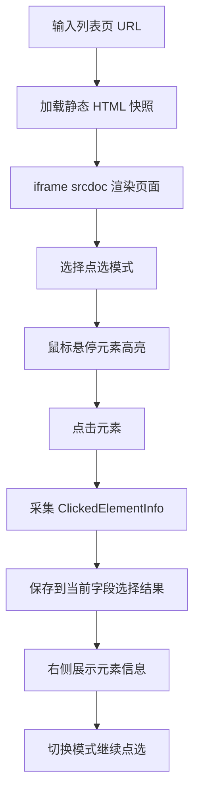

# HTML 爬虫配置工作台阶段二前端交互设计

## 1. 阶段定位

阶段二对应 PRD 中的“页面加载和点选原型”。

本阶段目标不是完成完整配置平台，而是先把可视化配置工作台的前端交互底座做出来：

- 用户可以输入 URL。
- 系统可以加载静态 HTML 页面快照。
- 前端可以用 `iframe srcdoc` 展示页面快照。
- 用户可以在 iframe 内悬停和点击元素。
- 前端可以采集被点击元素的结构化上下文。
- 用户可以按不同点选模式记录“列表项、标题、链接、日期、正文”等选择结果。

阶段二完成后，阶段三后端即可基于这些点选上下文生成 CSS 选择器和 `PolicyExtractRule`。

> 补充说明：点选式配置不能只依赖渲染后的可见页面。很多可提取信息隐藏在 DOM 属性或 HTML 结构里，例如 `href`、`title`、`data-*`、`content`。阶段二实现时必须同时参考 [HTML爬虫配置工作台阶段二DOM可提取信息设计.md](./HTML爬虫配置工作台阶段二DOM可提取信息设计.md)，在右侧展示“这个元素可以提取什么”的候选信息。

## 2. 阶段二目标

### 2.1 必须完成

- 搭建 Vue3 + Vite + TypeScript + Element Plus 前端工程。
- 实现 `HTML 配置工作台` 页面基础布局。
- 实现 URL 输入和页面加载动作。
- 实现 HTML 快照展示，使用 `iframe srcdoc`，不直接 iframe 访问目标站点。
- 实现 iframe 内元素 hover 高亮。
- 实现 iframe 内元素 click 选中。
- 实现点击后采集 `ClickedElementInfo`。
- 实现当前点击元素的 DOM 可提取信息展示，包括文本、属性、`innerHTML`、`outerHTML`、可见性和候选提取项。
- 实现点选模式切换。
- 实现每种点选模式的选择结果记录、重选、清除。
- 实现右侧面板展示被选元素信息。
- 阻止 iframe 内原网页链接跳转、表单提交、脚本副作用。

### 2.2 明确不做

- 不生成最终 CSS 选择器。
- 不生成 `PolicyExtractRule`。
- 不保存数据库配置。
- 不实现配置 CRUD。
- 不实现真实字段提取预览。
- 不接入 `HtmlExtractionEngine`。
- 不实现分页预览。
- 不实现详情页真实抽取。
- 不实现 JS 动态渲染。
- 不做用户权限。
- 不做复杂 UI 美化。

阶段二只负责“看得见、点得到、采得准、状态能保存到前端页面内存”。

## 3. 产品交互主流程



## 4. 页面整体布局

阶段二推荐三栏布局。

### 4.1 顶部区域

顶部提供页面级操作：

- 数据源名称输入框，可选。
- 列表页 URL 输入框。
- 加载页面按钮。
- 重新加载按钮。
- 当前页面加载状态。
- 默认模式 / 高级模式开关，阶段二可先展示但不做复杂能力。

### 4.2 左侧步骤区

左侧展示配置步骤和当前完成状态。

步骤：

1. 加载列表页。
2. 选择列表项。
3. 选择标题。
4. 选择链接。
5. 选择发布日期。
6. 选择摘要，可选。
7. 选择详情正文，阶段二只记录模式和选择，不做详情页加载闭环。

每一步展示状态：

- 未开始。
- 当前正在选择。
- 已选择。
- 需要重选。

### 4.3 中间网页快照区

中间区域为核心交互区：

- 使用 `HtmlSnapshotFrame` 组件。
- 内部用 `iframe srcdoc` 渲染 HTML。
- iframe 内注入交互脚本。
- iframe 内注入高亮样式。
- 用户所有点选都在此区域完成。

要求：

- iframe 高度可滚动。
- 外层页面不因为 iframe 内滚动而错乱。
- 点击链接不跳转。
- 点击按钮不触发表单。
- iframe 加载失败时展示错误占位。

### 4.4 右侧结果区

右侧展示当前点选和已选结果：

- 当前点选模式。
- 当前悬停元素摘要。
- 当前已选元素信息。
- 已配置字段列表。
- 点击元素的 tag、id、class、文本摘要、属性、路径。
- 清除当前字段按钮。
- 重选当前字段按钮。
- 高级模式下展示原始 JSON。

## 5. 前端目录结构

建议新增独立前端工程：

```text
frontend/
  package.json
  vite.config.ts
  tsconfig.json
  index.html
  src/
    main.ts
    App.vue
    router/
      index.ts
    api/
      htmlConfig.ts
    types/
      htmlConfig.ts
    views/
      HtmlConfigWorkbench.vue
    components/
      HtmlSnapshotFrame.vue
      SelectionStepPanel.vue
      SelectionModeToolbar.vue
      SelectionResultPanel.vue
      ElementInfoCard.vue
    utils/
      iframeBridge.ts
      elementPath.ts
      sanitizeHtml.ts
```

阶段二可先只实现一个路由：

```text
/html-config
```

## 6. 核心组件设计

### 6.1 `HtmlConfigWorkbench.vue`

职责：

- 页面总容器。
- 管理 URL、HTML 快照、当前模式、已选字段状态。
- 调用页面加载 API 或 Mock。
- 组合左右中三栏组件。

核心状态：

```ts
const pageState = reactive({
  sourceName: '',
  listUrl: '',
  html: '',
  title: '',
  finalUrl: '',
  statusCode: 0,
  loading: false,
  warnings: [] as string[],
  errors: [] as string[],
})

const selectionState = reactive({
  currentMode: 'ITEM' as SelectionMode,
  selections: {} as Partial<Record<SelectionMode, ElementSelection>>,
  hoveredElement: null as ClickedElementInfo | null,
})
```

### 6.2 `HtmlSnapshotFrame.vue`

职责：

- 接收 HTML 字符串。
- 使用 iframe `srcdoc` 渲染。
- 注入点选脚本。
- 注入高亮样式。
- 通过 `postMessage` 向父页面发送 hover/click 事件。
- 根据父页面传入的选中状态更新高亮。

输入：

```ts
interface Props {
  html: string
  currentMode: SelectionMode
  selections: Partial<Record<SelectionMode, ElementSelection>>
}
```

输出事件：

```ts
defineEmits<{
  hover: [info: ClickedElementInfo]
  select: [selection: ElementSelection]
  frameReady: []
  frameError: [message: string]
}>()
```

### 6.3 `SelectionModeToolbar.vue`

职责：

- 展示当前可选字段类型。
- 切换当前点选模式。
- 提醒用户当前应该点击什么。

模式按钮：

- 列表项。
- 标题。
- 链接。
-发布日期。
- 摘要。
- 详情正文。
- 发布机构。
- 文号。

### 6.4 `SelectionResultPanel.vue`

职责：

- 展示所有已选字段。
- 展示每个字段的元素摘要。
- 支持清除、重选、查看详情。

### 6.5 `ElementInfoCard.vue`

职责：

- 展示单个 `ClickedElementInfo`。

展示字段：

- 标签名。
- `id`。
- `classList`。
- 文本摘要。
- 主要属性。
- CSS 路径。
- Index 路径。
- 元素尺寸。

## 7. 点选模式定义

阶段二固定以下模式：

```ts
export type SelectionMode =
  | 'ITEM'
  | 'TITLE'
  | 'URL'
  | 'PUBLISH_DATE'
  | 'SUMMARY'
  | 'DETAIL_CONTENT'
  | 'ISSUING_AGENCY'
  | 'DOCUMENT_NUMBER'
```

展示文案：

| mode | 中文名 | 用户提示 |
|---|---|---|
| `ITEM` | 列表项 | 请点击一条完整的列表记录 |
| `TITLE` | 标题 | 请点击列表项中的标题文字 |
| `URL` | 链接 | 请点击可进入详情页的链接 |
| `PUBLISH_DATE` | 发布日期 | 请点击发布日期文字 |
| `SUMMARY` | 摘要 | 请点击摘要内容，可选 |
| `DETAIL_CONTENT` | 详情正文 | 请点击详情页正文区域 |
| `ISSUING_AGENCY` | 发布机构 | 请点击发布机构文字 |
| `DOCUMENT_NUMBER` | 文号 | 请点击文号文字 |

阶段二只记录当前 mode 下用户点击了哪个元素，不判断是否真的适合该字段。

## 8. 点选数据结构

### 8.1 `ClickedElementInfo`

这是阶段二最重要的产物，阶段三后端会基于它生成选择器。

```ts
export interface ClickedElementInfo {
  /** 标签名，小写，如 div / a / span / li / tr */
  tagName: string

  /** 元素 id，没有则为空 */
  id?: string

  /** class 列表 */
  classList: string[]

  /** 常用属性，href/title/src/name/data-* 等 */
  attributes: Record<string, string>

  /** 元素文本，去除连续空白并截断 */
  text: string

  /** 内部 HTML 摘要，截断展示；完整设计见 DOM 可提取信息设计文档 */
  innerHtml: string

  /** 外部 HTML 摘要，截断展示；完整设计见 DOM 可提取信息设计文档 */
  outerHtml: string

  /** 元素当前是否可见 */
  computedVisible: boolean

  /** 从 body 到当前元素的结构路径，如 ['body', 'div.main', 'ul.news-list', 'li', 'a'] */
  cssPath: string[]

  /** 从 body 到当前元素的同级索引路径，用于后端定位原始元素 */
  indexPath: number[]

  /** 当前元素在页面中的 nth-of-type 路径，可选 */
  nthPath?: string

  /** 元素在 iframe viewport 内的位置 */
  bounding?: {
    x: number
    y: number
    width: number
    height: number
  }

  /** 从当前 DOM 元素整理出的可提取项，例如文本、href 属性、title 属性、HTML */
  extractableCandidates: ExtractableCandidate[]
}
```

`ExtractableCandidate` 的完整定义和展示规则见 [HTML爬虫配置工作台阶段二DOM可提取信息设计.md](./HTML爬虫配置工作台阶段二DOM可提取信息设计.md)。

### 8.2 `ElementSelection`

```ts
export interface ElementSelection {
  mode: SelectionMode
  info: ClickedElementInfo
  selectedAt: number
}
```

### 8.3 采集属性白名单

iframe 脚本只采集必要属性，避免传输过大或泄露敏感信息。

优先采集：

- `href`
- `src`
- `title`
- `alt`
- `name`
- `role`
- `aria-label`
- `data-*`

忽略：

- `style`
- `onclick`
- `onmouseover`
- 其他 `on*` 事件属性

## 9. iframe 注入协议

### 9.1 渲染方式

阶段二使用：

```html
<iframe :srcdoc=\"instrumentedHtml\" sandbox=\"allow-same-origin\"></iframe>
```

说明：

- 不允许 `allow-scripts` 给原页面脚本执行机会。
- 但如果需要注入脚本，实际实现可采用空 iframe + `contentDocument.write()` 的方式写入 HTML 和注入脚本。
- 阶段二实现时必须保证原网页脚本不执行或副作用最小。

推荐实现方式：

1. 创建空 iframe。
2. 等 iframe ready。
3. 通过 `contentDocument.open/write/close` 写入经过处理的 HTML。
4. 注入交互脚本和样式。
5. 移除或禁用原始 `<script>`。
6. 拦截点击、提交、跳转。

### 9.2 注入样式

注入 CSS 类：

```css
.__crawler_hover__ {
  outline: 2px dashed #409eff !important;
  cursor: crosshair !important;
}

.__crawler_selected__ {
  outline: 3px solid #67c23a !important;
  background: rgba(103, 194, 58, 0.12) !important;
}

.__crawler_same_group__ {
  outline: 2px solid #e6a23c !important;
  background: rgba(230, 162, 60, 0.10) !important;
}
```

### 9.3 iframe → parent 消息

iframe 内点击/悬停后，通过 `postMessage` 发送：

```ts
interface FrameMessage {
  source: 'html-config-frame'
  type: 'hover' | 'select' | 'ready' | 'error'
  payload?: unknown
}
```

`select` payload：

```ts
{
  mode: SelectionMode
  info: ClickedElementInfo
  selectedAt: number
}
```

### 9.4 parent → iframe 消息

父页面可以发送：

```ts
interface ParentMessage {
  source: 'html-config-parent'
  type: 'set-mode' | 'clear-hover' | 'set-selections' | 'clear-selection'
  payload?: unknown
}
```

用途：

- 切换当前模式。
- 清除 hover。
- 回显已选元素。
- 清除某个字段选择。

## 10. 页面加载接口

阶段二可以使用临时真实接口，也可以先 Mock。

推荐直接实现或复用后端阶段一请求能力做一个最小接口：

```text
POST /api/html-config/load-page
```

请求：

```json
{
  \"url\": \"https://example.gov.cn/list.html\",
  \"headers\": {},
  \"timeoutMs\": 15000
}
```

返回：

```json
{
  \"html\": \"<html>...</html>\",
  \"finalUrl\": \"https://example.gov.cn/list.html\",
  \"statusCode\": 200,
  \"title\": \"页面标题\",
  \"warnings\": [],
  \"error\": null
}
```

如果阶段二不做后端接口，则前端先用 Mock：

```text
frontend/public/mock/list.html
```

但最终进入阶段三前，必须切换到真实 `load-page` 接口。

## 11. HTML 安全处理

阶段二前端展示的是外部网页 HTML，必须做基础安全隔离。

要求：

- 禁用原页面脚本。
- 拦截所有链接点击。
- 拦截所有表单提交。
- 不执行 inline event handler。
- 不把目标站点 HTML 直接插入主 DOM，只放进 iframe。
- iframe 与主页面通信只允许约定的 message 协议。

建议处理：

- 移除 `<script>` 标签。
- 移除所有 `on*` 属性。
- 将 `<a target>` 改为不跳转。
- 对 `href=\"javascript:...\"` 只保留属性文本，不执行。

## 12. 阶段二状态管理

阶段二不需要 Pinia，页面局部状态即可。

必须维护：

- 页面加载状态。
- 当前 HTML 快照。
- 当前点选模式。
- hover 元素。
- 每个模式下的已选元素。
- 错误和警告。

可选持久化：

- 暂存到 `localStorage`，避免刷新丢失。
- 阶段二不是必须。

## 13. 与阶段三的交付契约

阶段二必须给阶段三留下稳定接口。

阶段三后端需要的数据：

- 当前页面 HTML 或 `htmlSnapshotId`。
- 当前点选模式。
- 当前 `ClickedElementInfo`。
- 已选择的列表项 `ClickedElementInfo`。
- 当前页面 URL。

阶段三接口大致会使用：

```text
POST /api/html-config/suggest-item-selector
POST /api/html-config/suggest-field-rule
```

因此阶段二必须保证 `ClickedElementInfo` 结构稳定，不要随意改字段名。

## 14. 验收标准

阶段二完成后必须满足：

- 可以启动 Vue3 前端工程。
- 可以进入 `/html-config` 页面。
- 可以输入 URL 并加载 HTML 快照。
- 可以在 iframe 中看到接近真实网页的静态页面。
- 鼠标悬停任意元素时，该元素有明显 hover 高亮。
- 点击元素时，链接不跳转、表单不提交。
- 点击后右侧能展示 `ClickedElementInfo`。
- 点击后右侧能展示该元素背后的 DOM 可提取信息：可见文本、常用属性、`innerHTML`、`outerHTML`、可见性和候选提取项。
- 切换点选模式后，再点击元素会记录到对应模式。
- 已选字段可以清除和重选。
- 刷新当前 HTML 快照后，旧选择状态能被清空或明确提示失效。
- iframe 内页面脚本不会影响主应用。
- 阶段二不出现任何最终规则生成、数据库保存或正式抓取逻辑。

## 15. 阶段二开发顺序

建议按以下顺序开发：

1. 搭建 `frontend` 工程。
2. 接入 Vue Router 和 Element Plus。
3. 实现 `HtmlConfigWorkbench.vue` 三栏布局。
4. 实现 URL 输入和 Mock HTML 加载。
5. 实现 `HtmlSnapshotFrame.vue`，完成 iframe 渲染。
6. 实现 iframe hover 高亮。
7. 实现 iframe click 选中和 `ClickedElementInfo` 采集。
8. 实现点选模式工具栏。
9. 实现右侧选择结果面板。
10. 实现清除、重选。
11. 接真实 `load-page` 接口或保留可切换 Mock。
12. 完成阶段二验收。

## 16. 阶段二风险

### 16.1 iframe 注入脚本和 sandbox 冲突

如果使用 `srcdoc + sandbox`，注入脚本可能无法执行。

解决：

- 优先用空 iframe + `contentDocument.write()` 注入处理后的 HTML 和交互脚本。
- 原页面脚本必须禁用。

### 16.2 原页面 CSS 干扰高亮

部分网页 CSS 可能覆盖高亮样式。

解决：

- 高亮样式使用足够高优先级。
- 使用 `outline` 而不是改布局属性。
- 必要时使用 `!important`。

### 16.3 用户点到过细元素

用户可能点击到标题里的 `span`，而不是外层 `a`。

阶段二只记录真实点击元素，不做纠正。

阶段三由后端 `HtmlSelectorGenerator` 基于上下文向上寻找更合适的候选选择器。

### 16.4 静态 HTML 和真实浏览器显示不一致

阶段二只承诺展示后端抓取到的静态 HTML 快照。

如果页面依赖 JS 渲染，第一版提示不支持，不在阶段二解决。

